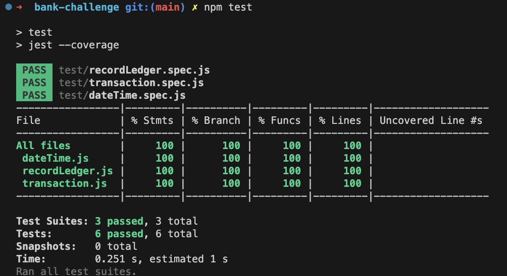
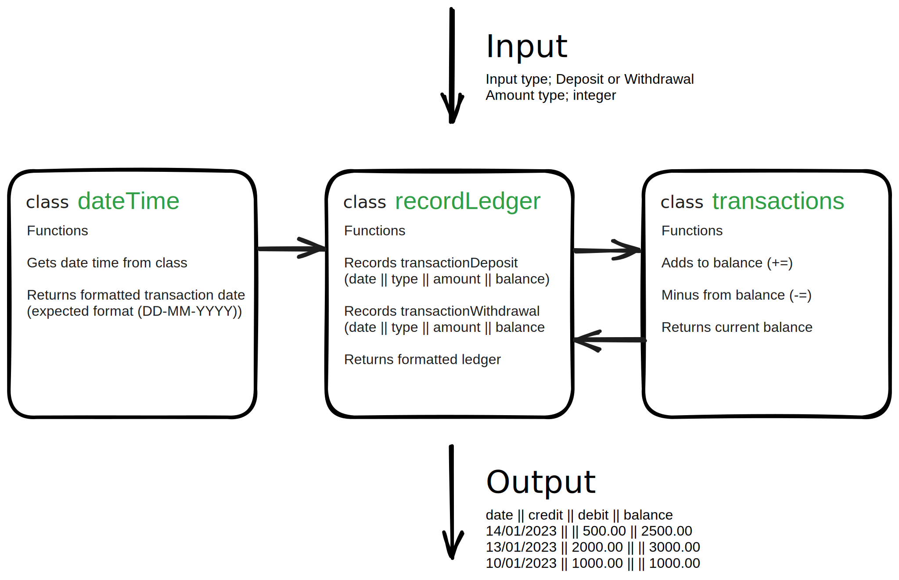
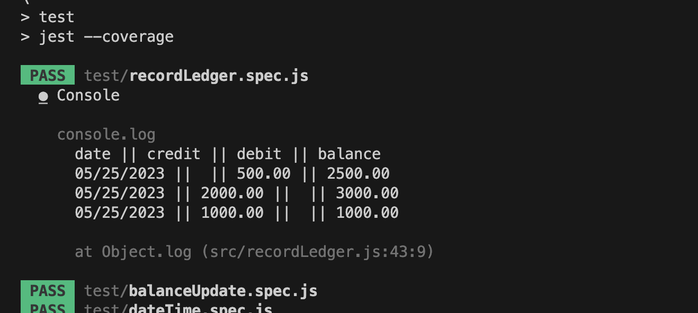

# Bank tech test

------

 <!-- ASSIGNMENT -->
## Makers Brief of the project

------

Today, you'll practice doing a tech test.

For most tech tests, you'll essentially have unlimited time.  This practice session is about producing the best code you can when there is a minimal time pressure.

You'll get to practice your OO design and TDD skills.

You'll work alone, and you'll also review your own code so you can practice reflecting on and improving your own work.

## Specification

### Requirements

* You should be able to interact with your code via a REPL like IRB or Node.  (You don't need to implement a command line interface that takes input from STDIN.)
* Deposits, withdrawal.
* Account statement (date, amount, balance) printing.
* Data can be kept in memory (it doesn't need to be stored to a database or anything).

### Acceptance criteria

**Given** a client makes a deposit of 1000 on 10-01-2023  
**And** a deposit of 2000 on 13-01-2023  
**And** a withdrawal of 500 on 14-01-2023  
**When** she prints her bank statement  
**Then** she would see

```
date || credit || debit || balance
14/01/2023 || || 500.00 || 2500.00
13/01/2023 || 2000.00 || || 3000.00
10/01/2023 || 1000.00 || || 1000.00
```

## Project setup

------

<!-- INSTALLATION -->
## How to run the project

------

### Prerequisites

Before running the project, ensure that you have installed `npm` and `node` in your local machine. If they are not installed, please follow the steps below.

- npm

  ```bash
  npm install npm@latest -g
  npm -v
  ```

- nvm & node

  ```bash
  brew install nvm
  nvm install node
  node -v
  ```

### Installation

- Clone the repo

    ```bash
    git clone https://github.com/toppy007/bank-challenge.git
    ```

------

 <!-- TESTING -->
## How to run the tests

------

- Install jest javascript testing framework from the root

    ```bash
    npm install --save-dev jest
    ```

- Then run the tests in a new terminal session

    ```bash
    npm test --coverage
    ```

- Install eslint for javascript testing framework from the root

    ```bash
    npm install eslint --save-dev
    ```

- Then run the tests in a new terminal session

    ```bash
    npm run lint-tests
    ```



------

 <!-- PLANNING -->
## Excalidraw of the proposed OO design.

------



------

 <!-- RUNNING THE PROGRAM IN NODE -->
## running the program

------

- Start Node from the root file commandline.

    ```bash
    node
    ```

- Require the nessary files

    ```bash
    const BalanceUpdate = require('./balanceUpdate');
    ```
  
- Initialize the objects related to transactions, date, and record keeping

    ```bash
    const update = new BalanceUpdate();
    const ledger = new RecordLedger(update);
    ```

- Interact with the programs inputs and outputs

    ```bash
    ledger.updateLedger(1000);
    ledger.updateLedger(2000);
    ledger.updateLedger(-500);

    console.log(ledger.printLedger());
    ```

------

 <!-- EXPECTED OUTPUT -->
## Expected Node Output

------



**How was this resource?**  
[😫](https://airtable.com/shrUJ3t7KLMqVRFKR?prefill_Repository=makersacademy/course&prefill_File=individual_challenges/bank_tech_test.md&prefill_Sentiment=😫) [😕](https://airtable.com/shrUJ3t7KLMqVRFKR?prefill_Repository=makersacademy/course&prefill_File=individual_challenges/bank_tech_test.md&prefill_Sentiment=😕) [😐](https://airtable.com/shrUJ3t7KLMqVRFKR?prefill_Repository=makersacademy/course&prefill_File=individual_challenges/bank_tech_test.md&prefill_Sentiment=😐) [🙂](https://airtable.com/shrUJ3t7KLMqVRFKR?prefill_Repository=makersacademy/course&prefill_File=individual_challenges/bank_tech_test.md&prefill_Sentiment=🙂) [😀](https://airtable.com/shrUJ3t7KLMqVRFKR?prefill_Repository=makersacademy/course&prefill_File=individual_challenges/bank_tech_test.md&prefill_Sentiment=😀)  
Click an emoji to tell us.

<!-- END GENERATED SECTION DO NOT EDIT -->